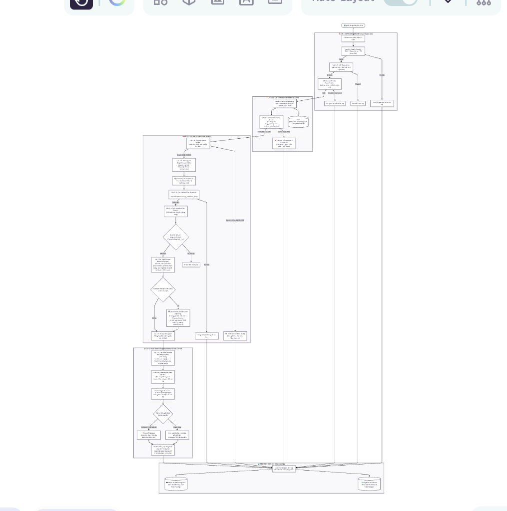
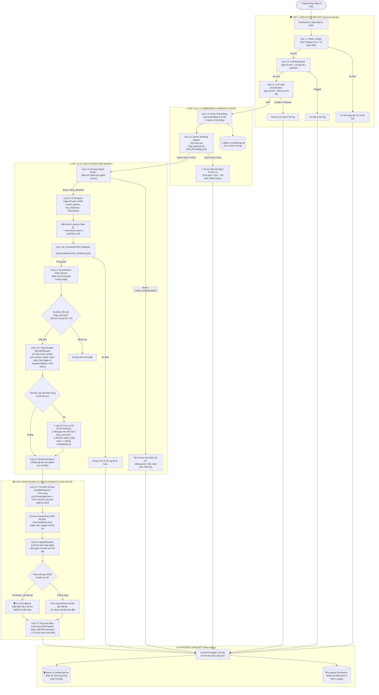

# 🚀 Blog_Agent - Hệ Thống AI Multi-Agent & Hybrid RAG

Hệ thống AI Multi-Agent thông minh tích hợp **RAG Hybrid (Vector Embedding + BM25Okapi)**, **Kiểm duyệt Bảo mật Guardrail 3 Lớp**, **Cào Dữ liệu Web Thời gian thực (DuckDuckGo Search & BeautifulSoup4)**, **Lập chỉ mục Cục bộ**, và **Thẩm định Ngữ nghĩa Chéo (Cross-semantic AgentEvaluator)**.

---

## 📐 Sơ Đồ Kiến Trúc & Quy Trình Hoạt Động (Architecture Flowchart)



<details>
<summary><b>🔍 Xem mã nguồn sơ đồ Mermaid (Mermaid Source Code)</b></summary>


</details>

---

## 📁 Cấu trúc Thư mục Dự án

```
Blog_Agent/
├── back-end/               # Server FastAPI Backend
│   ├── agent/              # Hệ thống Agent & RAG Core
│   │   ├── agents/         # SearchAgent đơn lẻ
│   │   ├── evaluation/     # AgentEvaluator (So sánh ngữ nghĩa chéo)
│   │   ├── guardrail/      # Security Guardrails (Lớp 1.1, 1.2, 1.3, 2.1b)
│   │   ├── multi/          # Multi-Agent Systems (Router, CriticAgent, ResearcherAgent)
│   │   ├── rag/            # Vector Embeddings, SQLite DB, Cosine Similarity, BM25Search
│   │   └── system_prompt/  # Tập hợp Centralized System Prompts
│   ├── config/             # Cấu hình môi trường & Langfuse Telemetry
│   ├── controllers/        # FastAPI API Endpoints (Chat, Admin Logs)
│   ├── dtos/               # Pydantic Schemas & DTOs
│   ├── services/           # Business Logic Services & Local Trace Logger
│   └── main.py             # File khởi chạy FastAPI App
├── front-end/              # Client Dashboard UI (Next.js / React)
│   └── src/components/     # BlogAssistant, AdminLogs, Timeline, ReflectionEditor
├── data/                   # Kho dữ liệu cục bộ (blog_posts.json, local_knowledge.json, trace_logs.json)
├── README.md               # Sơ đồ kiến trúc & Hướng dẫn sử dụng
└── start.sh                # Script khởi chạy đồng thời Backend & Frontend
```

---

## ⚡ Hướng dẫn Khởi chạy Dự án

```bash
# Cài đặt và khởi chạy toàn bộ hệ thống (FastAPI Backend + Next.js Frontend)
./start.sh
```
